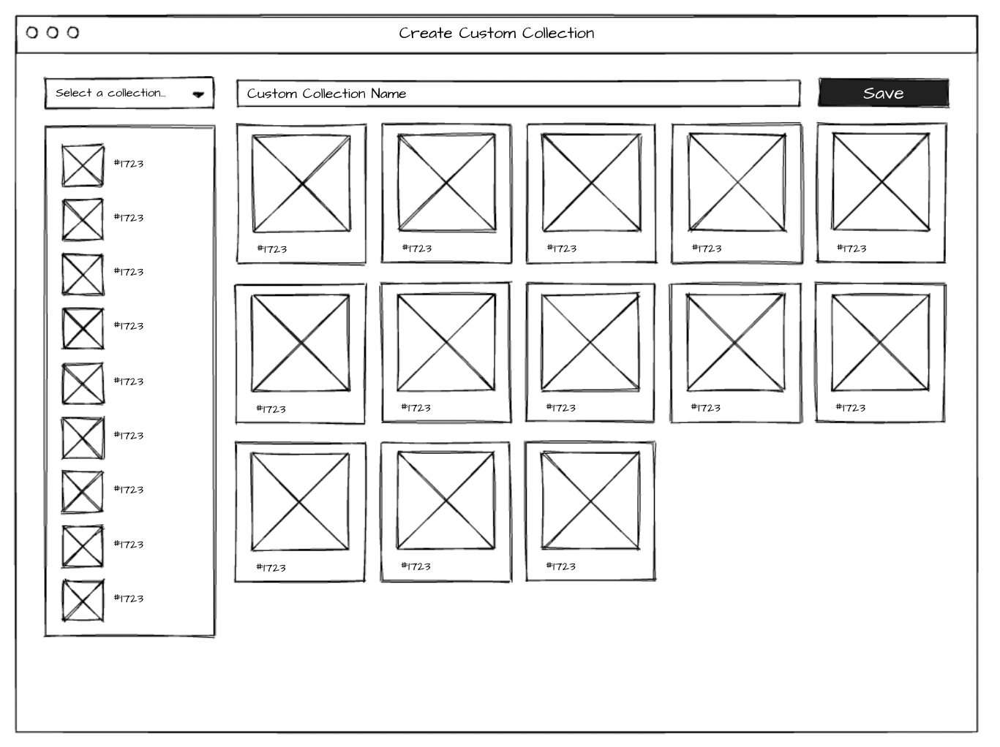
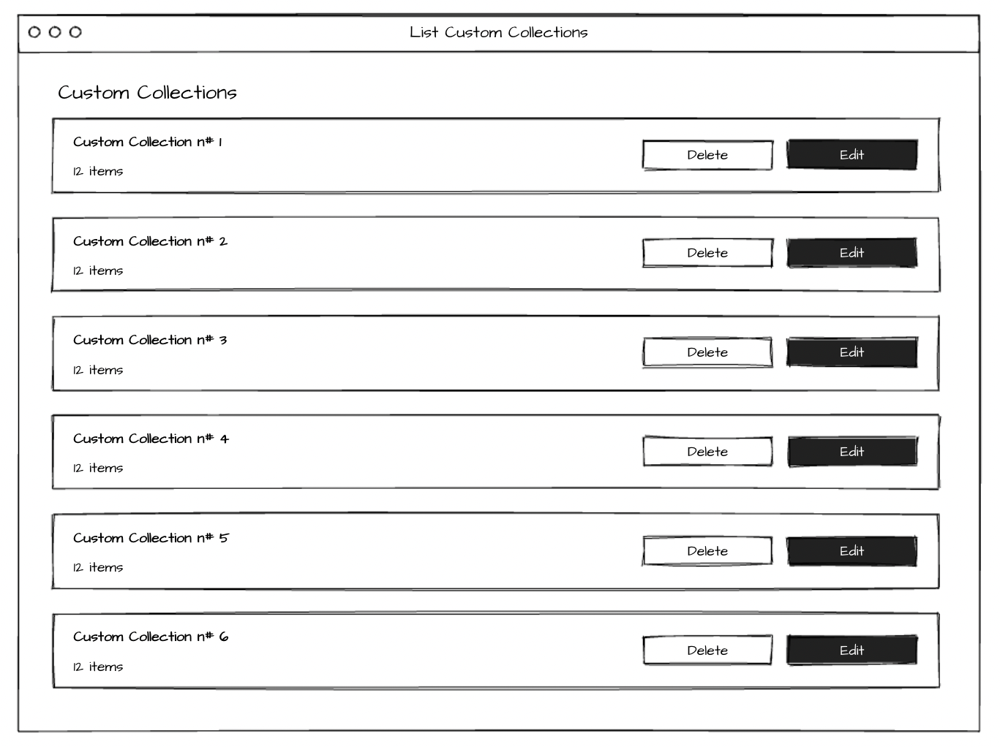

  
Project Description

# Frontend take-home: Custom Collections

In the NFT world tokens are organized in Collections. Most of the times, each collection groups thousands of NFTs making it a bit hard to keep track of what's happening with the specific tokens we're interested in.

For this take-home, we want you to build a little piece of the platform that will help users group tokens into one Custom Collection that can be followed and monitored. We want you to build a web app that lists all NFT collections available in the [Reservoir API](https://docs.reservoir.tools/reference), and will let the user select which particular tokens will be included in their own Custom Collection.

On the left side the user can select a collection from the dropdown. Then the token list below the dropdown will list the available NFTs in that collection.

The user should be able to drag & drop items into the right side section to add this item to the Custom Collection. Items added to the Custom Collection could be removed (this could be performed by clicking a call-to-action in each card).

A Custom Collection should have a non-empty name and we should give the user the ability to persist the Custom Collection.

Later the user should be able to see the list of created Custon Collections in the app.

Note that the wireframes in this document are just for reference. More UI elements will be required to be able to implement all features.

## Notes

- We only require the app to be built using React.
- You're free to use any other library.
- Some persistency layer is required. You're allowed to use any tecnology/architecture/pattern.

## Deliverable:

- Please fork this repo and push your solution.
- Runnable code in a local environment.
- Proper documentation, explaining design desitions and providing instruction for the setup of the local environment.
- Appropriate testing.

## Evaluation Criteria:

We should be able to execute your solution without much hassle, and the app should be intuitive to use. We will evaluate your code based on clarity, performance, and maintainability. Make sure to include relevant tests and documentation.

Let us know if you have any questions. Happy coding!

# Documentation

Live URL: https://nft-collection.pizzarello.dev/

This project was bootstrapped with [Create React App](https://github.com/facebook/create-react-app).

## Available Scripts

In the project directory, you can run:

### `npm install`

Install dependencies first.

### `npm start`

Runs the app in the development mode.\
Open [http://localhost:3000](http://localhost:3000) to view it in the browser.

The page will reload if you make edits.\
You will also see any lint errors in the console.

### `npm test`

Launches the test runner in the interactive watch mode.\
See the section about [running tests](https://facebook.github.io/create-react-app/docs/running-tests) for more information.

## Technologies

- Styling: Tailwindcss
- Testing: React Testing Library (Jest)
- Drag & drop: react-dnd
- Data fetching: react-query

## Persistence layer

The peristence layer was built using the localstorage for the following reasons:

- It provides 5mb for storing, which is enough for string data.
- The information is not required to be stored in a secure place
- Easy and quick to deliver the functionality.

## Testing

I ran into this [issue](https://github.com/react-dnd/react-dnd/issues/3443) that unfortunatly couldn't fix it. This was a blocker for building more interesting and complex tests.

## Decisions

### Routes

- Home - "/" - List of saved collections
- Create collection - "/collection" - Create a custom collection
- Edit collection - "/collection/:slug" - Edit saved collection

### Redirects

- If you go to "/" without saved collections, it's going to redirect to "/collection"
- After creating or editing a collection, it's going to redirect to "/home"

### Others

- You can create an empty collection (without tokens selected)
- Prevent adding same token twice in the same collection.

## Improvements

- Dedicate more hours for creating tests.

- Don't allow creating two collections with the same name or add a custom ID to identify collections with the same name

- Errors handling

- Build custom 404 pages (.ie "/collections/:slug" where slug doesn't exists)

- Clean minor warnings
